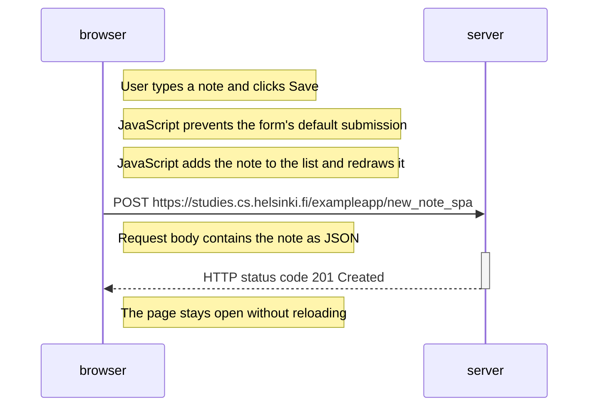

```mermaid    
    sequenceDiagram
        participant browser
        participant server

        Note right of browser: User types a note and clicks Save
        Note right of browser: JavaScript prevents the form's default submission
        Note right of browser: JavaScript adds the note to the list and redraws it

        browser->>server: POST https://studies.cs.helsinki.fi/exampleapp/new_note_spa
        Note right of browser: Request body contains the note as JSON
        activate server
        server-->>browser: HTTP status code 201 Created
        deactivate server

        Note right of browser: The page stays open without reloading
```