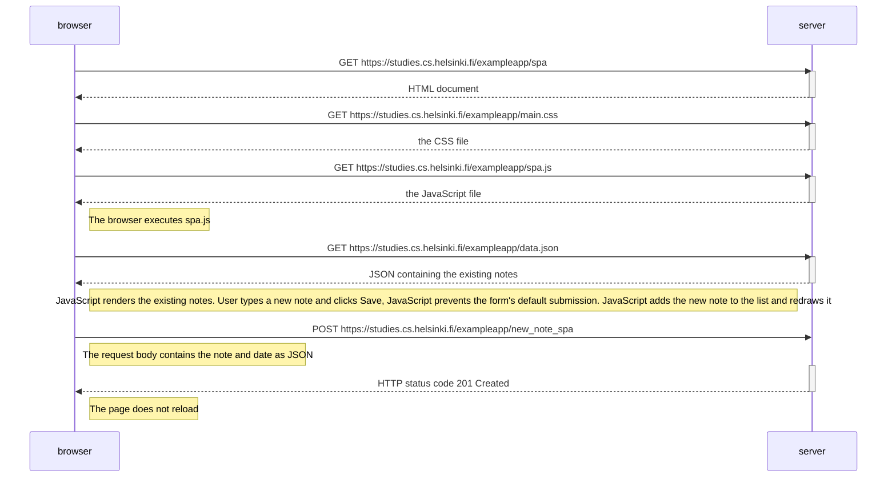

```mermaid    
    sequenceDiagram
    participant browser
    participant server

    browser->>server: GET https://studies.cs.helsinki.fi/exampleapp/spa
    activate server
    server-->>browser: HTML document
    deactivate server

    browser->>server: GET https://studies.cs.helsinki.fi/exampleapp/main.css
    activate server
    server-->>browser: the CSS file
    deactivate server

    browser->>server: GET https://studies.cs.helsinki.fi/exampleapp/spa.js
    activate server
    server-->>browser: the JavaScript file
    deactivate server

    Note right of browser: The browser executes spa.js

    browser->>server: GET https://studies.cs.helsinki.fi/exampleapp/data.json
    activate server
    server-->>browser: JSON containing the existing notes
    deactivate server

    Note right of browser: JavaScript renders the existing notes. User types a new note and clicks Save, JavaScript prevents the form's default submission. JavaScript adds the new note to the list and redraws it

    browser->>server: POST https://studies.cs.helsinki.fi/exampleapp/new_note_spa
    Note right of browser: The request body contains the note and date as JSON
    activate server
    server-->>browser: HTTP status code 201 Created
    deactivate server

    Note right of browser: The page does not reload
```
